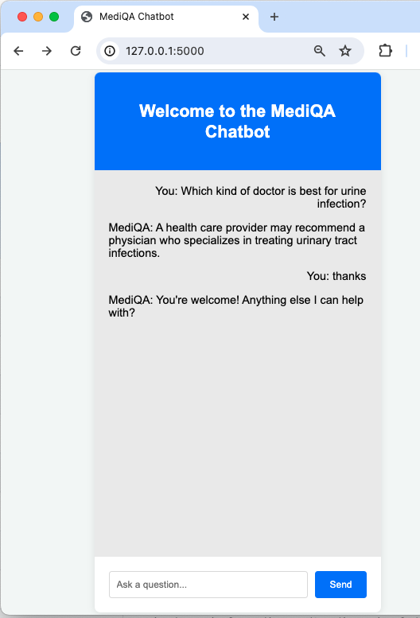

# Medical Chatbot for Patients

This repository details the development of a Medical Chatbot designed to provide patients with personalized and immediate access to medical information and services, utilizing AI and NLP techniques.

## Contents
- [Team Members](#team-members)
- [Introduction](#introduction)
- [Problems and Solutions](#problems-and-solutions)
- [Motivation](#motivation)
- [Solution Requirements](#solution-requirements)
- [System Architecture (Framework)](#system-architecture-framework)
- [Methodology](#methodology)
  - [Data Collection and Preprocessing](#1-data-collection-and-preprocessing)
  - [Model Development](#2-model-development)
  - [Experimental Design](#3-Experimental-Design)
  - [Evaluation Metrics Scores](#evaluation-metrics-scores)
  - [Human Evaluation](#human-evaluation)
- [Deployment](#Deployment)
- [Project Management](#project-management)
  - [Task Distribution](#task-distribution)
- [Dataset Information](#dataset-information)
- [Paper Summary by Team Members](#paper-summary-by-team-members)

## Team Members
- Sonu Adhikari – st124409
- Ashmita Phuyal – st124454
- Sai Haneesha Bestha – st124089
- Md Shafi Ud Doula – st124047
- Tanzil Al Sabah – st123845

## Introduction

### Project Background
Medical chatbots, powered by AI technology, provide personalized and convenient access to medical information and services, acting as virtual assistants for users(patients). They offer immediate responses to inquiries, guidance on health issues and medication management. This chatbot utilizes NLP techniques and vast medical data to enhance precision, empower users to seek accurate medical advice, make informed decisions, and access reliable healthcare information efficiently.

## Motivation
By addressing the challenges mentioned, the chatbot aims to achieve the following objectives:
- Empower users to make informed decisions about their health and medical conditions, enhancing overall health literacy and promoting proactive healthcare management.
- Provide a convenient and efficient platform for users to access medical information anytime, anywhere, facilitating timely decision-making and intervention in healthcare matters.
This project will serve as a practical application of the concepts studied in the NLP course and reinforce our learning and showcasing the real-world relevance of the technologies and strategies employed in improving healthcare accessibility and patient outcomes.

## Problems and Solutions

### Problems
- Limited Access to Healthcare Professionals: Long wait times for appointments,overburdened healthcare systems, geographical barriers and financial constraints results in the limited access to healthcare professionals
- Delayed Medical Attention: Lack of awareness or understanding of the seriousness of symptoms contributes to delayed medical attention, especially in case of Cancer.
- Technological problems: Traditional chatbots were rule-based and had limited understanding of natural languages and inability to learn and adapt which resulted in limited accuracy.

### Solutions
The key factors to deploy medical chatbots include scalability, availability, data collection, instant information provision, and cost efficiency.
- Scalability: Efficiently handles increased demand without compromising quality
- Availability: Provides 24/7 instant support for patients
- Data Collection: Analyzes patient data for informed insights and personalized care
- Instant Information: Offers rapid and accurate responses to inquiries
- Cost Efficiency: Optimizes operations, reduces costs, and streamlines tasks

## Related Works

1. Buoy Health

Features: Buoy Health is a conversational AI chatbot designed to provide personalized health assessments and guidance to users. It uses natural language processing to understand users' symptoms, medical history, and concerns, and then offers tailored recommendations such as possible conditions, next steps, and self-care advice. Buoy Health aims to empower users to make informed decisions about their health and navigate the healthcare system more effectively.
Objectives: The primary objective of Buoy Health is to improve healthcare access and outcomes by leveraging AI technology to deliver accurate and reliable health information and support to users. It aims to reduce unnecessary healthcare visits, alleviate patient anxiety, and facilitate early detection and management of medical conditions.
NLP Architecture: Buoy Health employs a combination of NLP techniques, including rule-based systems, machine learning models, and medical knowledge graphs. It uses advanced algorithms to analyze user input, extract relevant information, and match symptoms to potential conditions. The architecture may include components such as named entity recognition (NER), intent classification, and dialogue management systems.

2. Ada Health

Features: Ada Health is an AI-driven health assessment platform that offers personalized symptom analysis and health advice through conversational interactions. Users can describe their symptoms to Ada, and the chatbot will ask relevant questions to gather more information and provide possible explanations and recommendations. Ada Health aims to empower individuals to manage their health proactively and seek appropriate medical care when needed.
Objectives: The main objective of Ada Health is to democratize access to healthcare by leveraging AI technology to deliver comprehensive and reliable health assessments and recommendations to users worldwide. It aims to augment healthcare services, improve health literacy, and promote early intervention and prevention of diseases.
NLP Architecture: Ada Health utilizes a sophisticated NLP architecture consisting of deep learning models, probabilistic algorithms, and medical knowledge bases. It employs techniques like natural language understanding (NLU), sentiment analysis, and probabilistic reasoning to interpret user input, generate hypotheses, and provide personalized health insights. The architecture may incorporate pretrained language models, medical ontologies, and domain-specific knowledge graphs to enhance accuracy and relevance.

## Gap Between Related Work

The existing landscape of chatbots available on the market predominantly revolves around facilitating interactions based on users' medical history. These chatbots excel in managing and tracking users' existing medical conditions, enabling communication with healthcare providers, and aiding in the coordination of care based on past medical records. While these functionalities are invaluable for personalized healthcare management, they often fall short in addressing broader aspects of healthcare, such as medical health literacy, accurate diagnosis of new symptoms, and providing reliable information for diverse medical queries.

In contrast, our medical chatbot for patients is designed to fill this crucial gap by focusing on enhancing users' medical health literacy, providing accurate diagnoses, and addressing a wide range of medical queries beyond historical data. We have leveraged advanced language understanding and generation models, such as Seq2Seq and GPT-2, to develop a conversational chatbot capable of comprehensively addressing users' medical-related concerns. Through the integration of advanced language models, we strive to deliver a user-friendly and intelligent conversational interface that enhances health literacy, supports accurate diagnosis, and fosters proactive healthcare management.

## Solution Requirements

- Utilize advanced NLP for accurate comprehension of user queries and responses.
- Integrate with a constantly updated medical knowledge base.
- Conduct trials to identify the most effective model.
- Ensure smooth integration with a web application
- Offer a user-friendly interface to increase user satisfaction.

## System Architecture (Framework)

### GPT-2 Architecture 

## Dataset Information

We have used the MedQuad dataset from : 

- HuggingFace Dataset: [https://huggingface.co/datasets/Amirkid/MedQuad-dataset](https://huggingface.co/datasets/Amirkid/MedQuad-dataset)
- Github Dataset: [https://github.com/abachaa/MedQuAD?tab=readme-ov-file](https://github.com/abachaa/MedQuAD?tab=readme-ov-file)
  
## Methodology
### 1. Data Collection and Preprocessing

#### Datasets
- Sources: Leverage the MedQuad dataset and supplementary datasets from Huggingface and GitHub.

#### Data Preprocessing 
- We have used the GPT2TokenizerFast from the transformers library to tokenize text efficiently for processing with the GPT-2 model.
- Similarly, for the seq2seq model, we’re using NLTK library for carrying out the tokenization.
- Dataset is further splitted into training, validation and testing pairs on 80%, 10%, and 10% respectively

### 2. Model Development

- We have trained 2 models: Seq2Seq and GPT2.
- Integrate advanced NLP techniques like validation and perplexity,adaptation validation seq2seq for high quality performance.

### 3. Experimental Design

We conducted experiments to train and fine-tune two models, namely GPT-2 and Seq2Seq, for medical question-answering (QA) tasks. Below are the details of the experimental design and hyperparameters used for each model:

#### a. GPT-2 Model:
- Training Data: We utilized a dataset consisting of 143,250 samples for training the GPT-2 model.
- Fine-tuning: The GPT-2 model was fine-tuned on medical QA data to adapt it specifically for medical-related inquiries.
Hyperparameters for Fine-Tuning:
- Evaluation Strategy: Epoch-based evaluation
- Learning Rate: 2e-5
- Weight Decay: 0.01
- Number of Training Epochs: 3

#### b. Seq2Seq Model:
-Training Data: Similar to the GPT-2 model, we used the same dataset containing 143,250 samples for training the Seq2Seq model.
Hyperparameters:
- Hidden Layers: 512
- Number of Iterations: 15,000
- Teacher Forcing Ratio: 0.5
- Learning Rate Encoder: 0.0001
- Learning Rate Decoder: 0.0005
- Optimizer: Adam Optimizer

Both models were trained using these hyperparameters to optimize their performance for medical question-answering tasks. The choice of hyperparameters was based on experimentation and empirical observations to achieve a balance between model complexity, training efficiency, and task-specific requirements. Additionally, the evaluation strategy for both models involved monitoring performance metrics such as accuracy, loss, and convergence over the specified number of training epochs.

### 4. Evaluation

- Apply a suite of metrics, including BLEU, ROGUE.
- Expand evaluation to include precision, recall, and F1-score to gauge the relevance and accuracy of medical advice.

### 5. Result

From comparing the results between the GPT-2 and Seq2Seq models using various evaluation metrics, including BLEU, ROUGE, precision, recall, and F1-score, we observed the following outcomes:

##### GPT-2 Model:
- Achieved better scores across multiple evaluation metrics.
- Demonstrated decent performance overall.
- Showed relatively better human evaluation results compared to the automated metrics.

##### Seq2Seq Model:
- Displayed a decent performance but was outperformed by the GPT-2 model in most evaluation metrics.
- While it produced acceptable results, it did not achieve the same level of effectiveness as the GPT-2 model.
- Human evaluation revealed lower satisfaction compared to the GPT-2 model, suggesting limitations in generating relevant and accurate medical advice.

Overall, the GPT-2 model exhibited better performance across various evaluation metrics, indicating its superiority in generating paraphrases and providing medical advice with higher relevance and accuracy. The Seq2Seq model, while performing decently, fell short in comparison to the GPT-2 model, particularly in terms of human evaluation and certain automated metrics.

## Evaluation Metrics Scores

| SN | Metric | Seq2Seq | GPT2 |
|----|-------|----------|----------|
| 1 | BLUE Score | 0.1875| 0.3056 |
| 2 | ROUGE Score| 0.4170 | 0.3934|
| 3 | Precision  | 0.2648 | 0.3647 |
| 4 | Recall| 0.1485| 0.2485 |
| 5 | F1-Score | 0.1723| 0.2723 |

1. BLUE Score:
- The BLUE (Bilingual Evaluation Understudy) score measures the similarity between the generated text and human reference text.
- The Seq2Seq model achieves a BLUE score of 0.1875, indicating moderate similarity.
- In contrast, the GPT2 model achieves a higher BLUE score of 0.3056, indicating closer similarity to human reference text compared to Seq2Seq.

2. ROUGE Score:
- The ROUGE (Recall-Oriented Understudy for Gisting Evaluation) score assesses the overlap between the generated text and human reference text in terms of n-grams.
- The Seq2Seq model achieves a ROUGE score of 0.4170, indicating a relatively high overlap.
- However, the GPT2 model's ROUGE score is slightly lower at 0.3934, suggesting a slightly lower overlap with the reference text compared to Seq2Seq.

3. Precision:
- Precision measures the proportion of relevant information in the generated text.
- The Seq2Seq model achieves a precision score of 0.2648, indicating that about 26.48% of the generated text is relevant.
- In contrast, the GPT2 model achieves a higher precision score of 0.3647, indicating that about 36.47% of the generated text is relevant, which is notably higher than Seq2Seq.

4. Recall:
- Recall measures the proportion of relevant information in the reference text that is captured by the generated text.
- The Seq2Seq model achieves a recall score of 0.1485, indicating that about 14.85% of relevant information from the reference text is captured.
- The GPT2 model achieves a higher recall score of 0.2485, indicating that about 24.85% of relevant information from the reference text is captured, which is notably higher than Seq2Seq.

5. F1-Score:
- The F1-score is the harmonic mean of precision and recall, providing a balanced measure of both metrics.
- The Seq2Seq model achieves an F1-score of 0.1723.
- However, the GPT2 model achieves a higher F1-score of 0.2723, indicating better overall performance in terms of both precision and recall compared to Seq2Seq.

In summary, while the Seq2Seq model may excel in certain metrics like ROUGE score, the GPT2 model generally outperforms it across most metrics, including precision, recall, and F1-score, indicating its superior ability to generate text that closely resembles human-written text and captures relevant information from the reference text.

## Human Evaluation
| Category             | Rating (1-5) | Definitions and Criteria                                                                                                   |
|----------------------|--------------|----------------------------------------------------------------------------------------------------------------------------|
| Medical Accuracy     | 1-5          | 1 (Poor): Consistently incorrect, misleading. 2 (Fair): Often inaccurate, lacks detail. 3 (Average): Generally accurate, some errors. 4 (Good): Mostly accurate, minor inaccuracies. 5 (Excellent): Highly accurate, detailed, fully reliable. |
| Guideline Adherence | 1-5          | 1 (Poor): Ignores clinical guidelines. 2 (Fair): Struggles with guidelines, frequent errors. 3 (Average): Generally follows guidelines. 4 (Good): Consistently adheres to guidelines. 5 (Excellent): Perfect adherence, no exceptions. |
| Clarity              | 1-5          | 1 (Poor): Very confusing, unclear. 2 (Fair): Somewhat understandable, uses complex jargon. 3 (Average): Clear with occasional complex language. 4 (Good): Very clear, minimal jargon. 5 (Excellent): Exceptionally clear, straightforward. |
| Empathy              | 1-5          | 1 (Poor): Completely detached, inappropriate. 2 (Fair): Limited empathy, often seems indifferent. 3 (Average): Shows basic empathy, somewhat supportive. 4 (Good): Very empathetic and supportive. 5 (Excellent): Exceptionally empathetic, always supportive. |
| Response Relevance   | 1-5          | 1 (Poor): Responses mostly irrelevant or off-topic. 2 (Fair): Often irrelevant or slightly off-topic. 3 (Average): Mostly relevant, some off-topic responses. 4 (Good): Highly relevant, consistently on-topic. 5 (Excellent): Always relevant, perfectly on-topic. |

| Category             | Rating (1-5) | Evaluator Comments (Doctors' Feedback)                                                                                               |
|----------------------|--------------|---------------------------------------------------------------------------------------------------------------------------------------|
| Medical Accuracy     | 2            | "Frequently inaccurate or overly generic, lacking specific medical detail."                                                          |
| Guideline Adherence | 2            | "Often fails to follow clinical guidelines, especially in complex cases."                                                            |
| Clarity              | 3            | "Responses are understandable but sometimes use jargon that could confuse patients."                                                   |
| Empathy              | 2            | "Struggles to convey genuine empathy, often comes off as detached."                                                                   |
| Response Relevance   | 2            | "Irrelevant or off-topic responses are common, particularly in nuanced discussions."                                                   |

## Deployment
##### Chat Interface Functionality

- Allows users to ask questions, send them, and receive responses from the chatbot.
- Messages are displayed in a visually distinct format, with user messages on the right and bot responses on the left.

 

